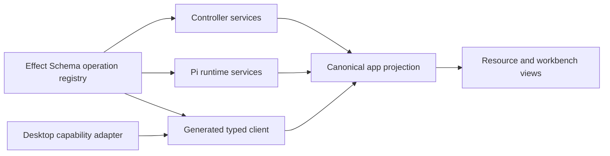
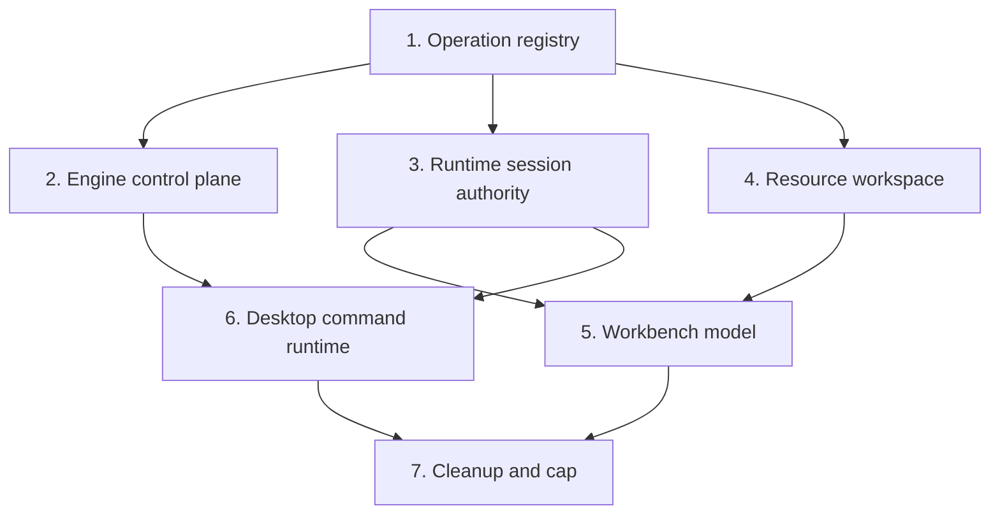

# 60k feature-parity architecture

Baseline: `origin/main` at `f2e8911c2e19f3733e2fcd6b753aa9c59bfe1d37`.

## Completion contract

Local Studio must contain no more than 60,000 semantic lines of authored production code without
removing or narrowing any current feature. The count includes tracked production TypeScript,
JavaScript, JSX, TSX, CSS, JSON, YAML, shell, and Python under `controller`, `frontend/src`,
`frontend/desktop`, `services`, `shared`, and `scripts`. It excludes dependencies, generated build
output, fixtures, tests, and symlinks.

The starting count is 107,673 lines. Reaching the cap requires at least 47,673 lines of structural
reduction. Lockfile deletion, test deletion, generated-code relocation, minification, denser
formatting, and feature retirement do not count.

Feature parity means preserving all externally visible behavior across:

- model discovery, recipes, downloads, installation, launch, stop, metrics, logs, and usage;
- vLLM, SGLang, llama.cpp, MLX, local and remote targets, rigs, and device selection;
- speech installation, voice management, transcription, synthesis, and runtime recovery;
- Pi sessions, streaming, queueing, steering, compaction, tools, goals, and subagents;
- projects, files, Git, pull requests, browser, terminal, automations, plugins, skills, providers,
  connectors, Google account, and Litter mobile transport;
- browser and packaged desktop startup, settings, secure storage, pairing, updates, and recovery.

## Target budget

| Ownership boundary                                   | Current lines | Target lines | Remaining reduction |
| ---------------------------------------------------- | ------------: | -----------: | ------------------: |
| Controller and controller contracts                  |        21,961 |       12,500 |               9,461 |
| Agent runtime and shared agent contracts             |        16,551 |        8,000 |               8,551 |
| Frontend features                                    |        48,180 |       25,000 |              23,180 |
| Frontend app, API, hooks, library, store, and UI kit |        11,328 |        8,000 |               3,328 |
| Electron runtime                                     |         6,433 |        5,000 |               1,433 |
| Installers and remaining shared production data      |           806 |        1,500 |                -694 |
| **Total**                                            |   **105,259** |   **60,000** |          **45,259** |

The current column is measured from this PR at `1916f164902a437768bc2f4d8405c16be4f2ffc0`.
The authoritative acceptance number is the semantic count produced by the command in the
measurement section.

## Current checkpoint

This PR has structurally removed 2,414 semantic production lines from the current main baseline.
The delivered slices centralize agent and terminal proxy policy, JSON persistence, usage
normalization, recipe fields and engine plans, workspace ownership, PTY ownership, page-to-view
state ownership, searchable resource collections, decoded JSON requests, appearance controls, the
complete engine specification, and all 85 controller Effect route adapters. The remaining 45,259
lines are not claimed as complete work.

Parity evidence at this checkpoint includes 90 controller checks, 97 agent-runtime integration
checks, recorded browser coverage for every top-level route, a recorded real-PTY open, command,
chat switch, reopen, and scrollback path, and five recorded provider catalog, OAuth, API-key, and
cloud-chat integration flows.

## Target architecture



The reduction depends on five ownership rules:

1. Each operation is declared once. The declaration owns path, method, access policy, body limit,
   input schema, output schema, timeout, and retry policy. Hono routes, Next proxies, and browser
   clients are derived from it.
2. Each long-lived fact has one authority. Controller services own model lifecycle and hardware;
   the Pi runtime owns session lifecycle and transcript state; the desktop owns OS capabilities.
   Frontend stores project those authorities instead of replaying parallel state machines.
3. Resource management is schema-driven. Recipes, runtimes, providers, plugins, skills, voices,
   connectors, rigs, and controllers use shared list, detail, action, field, status, and job
   primitives with resource-specific data rather than resource-specific screen frameworks.
4. Engine variation is data. One engine specification owns discovery, installation, launch flags,
   environment, devices, health, and capability metadata for vLLM, SGLang, llama.cpp, and MLX.
5. Compatibility is isolated at the boundary. Old payload aliases and persisted-state migrations
   are decoded once into current contracts and never branch through the rest of the application.

## Reduction waves

### Wave 1: one operation registry

Replace route modules and handwritten client methods with operations declared in canonical
contracts. The registry generates controller route adapters, agent proxy policy, controller proxy
policy, browser calls, and consistent errors.

Target reduction: 4,500 lines.

Acceptance:

- every current path and HTTP method remains reachable;
- authentication, origin checks, body limits, abort propagation, streaming, and retry behavior are
  recorded through browser-to-runtime tests;
- contract decoding rejects the same invalid boundary values;
- no route policy exists outside the registry.

The first slices are complete: 35 agent route modules use one policy-routed catch-all, and all 85
controller product routes use one typed Effect adapter while retaining their exact method, access,
documentation, response, and Hono RPC typing.

### Wave 2: one engine control plane

Merge `modules/compute` lifecycle ownership with `modules/engines` runtime ownership. Replace the
compute bridge, per-engine launchers, runtime-target adapters, and duplicated capability probes with
one `EngineSpec` and one supervised `EngineInstance` lifecycle.

Target reduction: 6,500 lines.

Acceptance:

- install, update, inspect, download, launch, readiness, stop, failure, and recovery pass for every
  engine;
- local, SSH, DGX, CUDA, ROCm, Metal, and CPU target selection retain the current behavior;
- multi-model serving, reservations, process identity, logs, and usage attribution remain intact;
- real vLLM and SGLang validation never disables CUDA graphs or forces eager execution.

### Wave 3: Pi owns sessions and transcripts

Make the runtime's `AgentSession` snapshot the canonical source for current messages, queue, model,
usage, tools, and turn state. Stream authoritative snapshots and compact mutations to the browser.
Delete the second transcript state machine assembled from Pi events, the duplicate session-status
projection, and the replay-specific grouping layer. Keep durable JSONL loading and migrations at
the runtime boundary.

Target reduction: 7,500 lines.

Acceptance:

- create, resume, reconnect, rename, archive, fork, queue, steer, follow-up, stop, compact, and
  context usage are recorded;
- streaming text, thinking, tool arguments, tool results, errors, aborts, images, and attachments
  match current rendering;
- an optimistic user message is reconciled once, including multiple steers and reconnects;
- Litter identities, signed requests, pagination, idempotency, crash reconciliation, and private
  runtime metadata remain unchanged.

### Wave 4: one resource workspace

Build typed `ResourceDefinition`, `ResourceStore`, `ResourceList`, `ResourceDetail`, `ResourceForm`,
`ResourceAction`, and `JobProgress` primitives. Express recipes, models, downloads, engines,
runtime targets, providers, plugins, skills, connectors, voices, rigs, controllers, and automation
records as definitions.

Target reduction: 11,000 lines.

Acceptance:

- every list field, empty state, filter, selection, edit form, secret field, validation message,
  destructive confirmation, progress state, and action remains visible and keyboard accessible;
- Configure, Recipes, Settings, Integrations, Setup, Dashboard, and Logs recordings cover each
  resource state;
- secrets remain write-only and no provider, connector, or controller credential enters browser
  persistence unintentionally.

### Wave 5: one Workbench model

Replace workspace, project, pane, transcript-cache, draft, navigation, tool, and view-local stores
with a normalized Workbench store. Keep one record per project, session, pane, terminal, browser,
draft, and tool selection. Derive navigation and view state through selectors. Use one command
registry for composer, quick panel, session, tool, file, and workspace actions.

Target reduction: 14,000 lines.

Acceptance:

- project and session navigation, pinned order, drafts, multi-pane layout, quick panel, filesystem,
  Git diff, pull requests, browser, terminal owners, and tool selection persist across restart;
- no session disappears during reconnect, hydration, update, or controller changes;
- multiple open sessions and panes do not share transient state;
- keyboard, mobile, empty, loading, error, and responsive states match recordings.

### Wave 6: one desktop command runtime

Replace the monolithic repository command script and parallel desktop server lifecycle helpers with
small declarative command definitions and one supervised child-process primitive. Reuse it for
frontend, agent runtime, controller, PTY, packaging, smoke, update, and restart flows.

Target reduction: 3,500 lines.

Acceptance:

- setup, development, production start, standalone completion, package, signing inputs, desktop
  smoke, update install intent, server restart, PTY cleanup, and shutdown pass;
- packaged runtime paths and secure storage remain owned by the desktop process;
- the installed app is exercised after packaging, not inferred from source or CI.

### Wave 7: boundary cleanup and cap enforcement

Delete transitional adapters only after all consumers use the canonical boundary. Collapse static
catalogues into typed tuples, remove re-export-only modules, centralize persisted-state codecs, and
enforce the line budget in the repository audit command.

Target reduction: 2,572 lines plus contingency needed to finish below 60,000.

Acceptance:

- the production inventory is at or below 60,000 semantic lines;
- the full repository check, controller/runtime integration suite, browser E2E suite, and packaged
  desktop smoke pass;
- recorded artifacts show both the user action and visible result;
- the branch contains no feature flags that hide removed behavior and no generated implementation
  moved outside the measured roots.

## Dependency order



Waves can contain multiple small commits, but a compatibility adapter is removed only in the same
commit that moves its final consumer. Every commit must leave the branch buildable.

## Measurement

The acceptance inventory is reproducible from tracked, non-symlink files:

```sh
git ls-files -s |
  awk '$1 != "120000" {print substr($0,index($0,"\t")+1)}' |
  rg '^(controller|frontend/src|frontend/desktop|services|shared|scripts)/' |
  rg '\.(ts|tsx|js|jsx|mjs|css|json|ya?ml|sh|py)$' |
  rg -v '(^|/)(node_modules|\.next|dist|build|test|tests|__tests__|fixtures)(/|$)|\.(test|spec)\.' \
  > production-files.txt
npx cloc --list-file=production-files.txt
```

Each PR update records the commit, total, delta from 107,673, validation commands, recordings, and
remaining gap. Estimates never count as delivered reduction.
