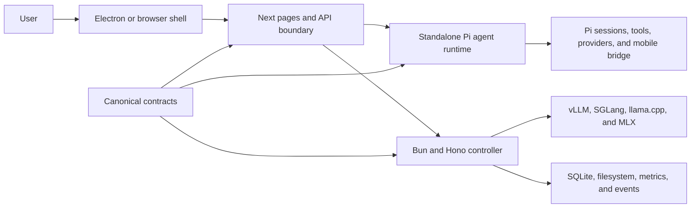

# Codebase reduction audit

Baseline: `origin/main` at `abb9f65dd19c451c7b10077ff58469dffe121155`.

## Decision

Local Studio cannot lose 50% of its authored production code without losing a major product
surface or moving that complexity into another package. The repository is already clean by the
usual mechanical measures: the configured dead-code, dependency, clone, cycle, type, lint, build,
and test gates all pass.

The honest target is:

1. Remove 12,000-24,000 production lines while preserving the current product.
2. Choose which major product surface to retire before pursuing the remaining reduction to 50%.

Deleting lockfiles, generated artifacts, or existing tests would make the line count look smaller
without making the shipped system simpler. Those are excluded from the production target.

## Baseline

| Scope                       | Files | Physical lines | Meaning                                        |
| --------------------------- | ----: | -------------: | ---------------------------------------------- |
| All tracked Git content     |   949 |        157,746 | Includes configuration, docs, locks, and tests |
| Authored production content |   856 |        122,544 | Reduction denominator                          |
| Generated lockfiles         |     4 |         27,027 | Reproducibility data, not product logic        |
| All tests and fixtures      |    80 |          8,171 | Validation, not production logic               |
| Recorded E2E suite          |    13 |          1,313 | Browser acceptance surface                     |
| Non-E2E tests               |    67 |          6,858 | Existing regression coverage                   |
| Symlinks                    |     4 |              4 | Three hooks and the canonical script link      |
| Binary assets               |     5 |              0 | Icons and PNG assets                           |

The 50% authored-production target is **61,272 lines removed**.

Installed and built size is a different metric:

| Surface                    | Current local size |
| -------------------------- | -----------------: |
| Frontend dependencies      |             1.5 GB |
| Controller dependencies    |             291 MB |
| Agent-runtime dependencies |             268 MB |
| Shared dependencies        |              54 MB |
| Next standalone output     |             278 MB |
| Next static assets         |               7 MB |
| Standalone agent runtime   |              47 MB |

The 971 MB Next build cache is excluded because it is neither tracked nor shipped.

## Validation evidence

The baseline `npm run check` passes:

- TypeScript, ESLint, package integrity, contract ownership, repository structure, and production
  builds.
- Knip reports no dead files or exports in its configured project surfaces.
- Depcheck reports no unused declared dependencies.
- jscpd reports no clones at the configured 30-line/200-token threshold in the frontend or
  controller.
- Madge scans 559 frontend files and reports no circular dependency.
- The existing release self-tests and frontend, controller, and agent-runtime suites pass.

Every tracked blob was read for the inventory. TypeScript and JavaScript sources were parsed into
an import graph and declaration inventory. Binary assets were identified separately. The result is
a complete module-level map, not a sample of large files.

## Runtime architecture

The repository contains two large products sharing one shell:

- A model-operations workstation: controller, engines, recipes, hardware, downloads, proxy,
  speech, status, configure, logs, and usage.
- An agent workstation: Pi sessions, transcript state, tools, projects, browser, terminal,
  automations, providers, plugins, goals, subagents, and mobile session transport.

That product split is the central reason a feature-preserving 50% cut is not available.

## Module map

Line counts below are production TypeScript and JavaScript. CSS, Python, shell, and configuration
remain in the repository baseline but are listed separately where material.

### Controller

| Module                           | Lines | Responsibility                                                        |
| -------------------------------- | ----: | --------------------------------------------------------------------- |
| `controller/contracts`           | 1,407 | Canonical browser/controller HTTP shapes                              |
| `controller/src/config`          |   358 | Environment and persisted controller configuration                    |
| `controller/src/core`            |   809 | Commands, Effect runtime, errors, logging, validation, observability  |
| `controller/src/http`            |   694 | Hono app, middleware, security, SSE, route registration               |
| `controller/src/modules/compute` | 2,989 | Host/device model, launch plans, reservations, lifecycle, supervision |
| `controller/src/modules/engines` | 4,498 | Runtime discovery, installs, jobs, recipes, downloads, engine specs   |
| `controller/src/modules/models`  | 1,177 | Model browsing and recipe persistence                                 |
| `controller/src/modules/proxy`   | 2,055 | OpenAI routes, streaming, reasoning, tools, accounting                |
| `controller/src/modules/speech`  | 3,376 | Chatterbox runtime, storage, worker, voices, synthesis                |
| `controller/src/modules/audio`   |   481 | OpenAI-compatible audio route adapters                                |
| `controller/src/modules/studio`  | 1,183 | Settings, rigs, providers, diagnostics, storage, presets              |
| `controller/src/modules/system`  | 3,576 | GPUs, metrics, logs, usage, compatibility, events, leases             |
| `controller/src/services`        |   304 | Provider routing and STT/TTS adapters                                 |
| `controller/src/stores`          | 1,058 | SQLite-backed settings, requests, usage, and rigs                     |
| `controller/src/app-context.ts`  |   244 | Resource construction, ownership, and scoped shutdown                 |
| `controller/src/main.ts`         |   113 | Process boot, supervisor, collector, server, and signals              |

The controller is about 24,300 production TypeScript lines including contracts. Engines, system,
speech, and compute account for most of it.

### Frontend and desktop

| Module                               |  Lines | Responsibility                                                              |
| ------------------------------------ | -----: | --------------------------------------------------------------------------- |
| `frontend/src/features/agent`        | 30,131 | Workbench state, transcript, composer, panes, projects, tools, and UI       |
| `frontend/src/features/recipes`      |  7,652 | Model discovery, recipe editing, options, launch preparation                |
| `frontend/src/features/settings`     |  5,327 | App, controller, runtime, agent, profile, terminal, and appearance settings |
| `frontend/src/features/integrations` |  3,211 | Providers, plugins, skills, Google account, and Chatterbox UI               |
| `frontend/src/features/dashboard`    |  2,483 | Status, GPUs, controller matrix, launch and stop actions                    |
| `frontend/src/features/setup`        |  2,448 | First-run hardware, engine, model, launch, and benchmark flow               |
| `frontend/src/features/logs`         |  1,187 | Log sessions, server log view, OpenAPI panel                                |
| `frontend/src/features/configure`    |  1,076 | Consolidated machine/model/integration/server navigation                    |
| `frontend/src/features/shell`        |    938 | Navigation, profile, phone pairing, and updates                             |
| `frontend/src/features/usage`        |    770 | Usage normalization, heatmap, and page                                      |
| `frontend/src/ui`                    |  3,510 | Shared controls, drawers, forms, lists, page primitives, icons              |
| `frontend/src/hooks`                 |  1,007 | Controller events and realtime status projection                            |
| `frontend/src/lib`                   |  1,886 | Auth, security, themes, formatting, shared browser utilities                |
| `frontend/src/lib/api`               |  1,840 | Typed controller client and streaming transports                            |
| `frontend/src/app/api/agent`         |  1,492 | Security-checked Next-to-agent boundary                                     |
| Other Next API routes                |  1,274 | Controller proxy, settings, bootstrap, updates, Hugging Face                |
| Pages and instrumentation            |  1,016 | Thin route shells and Node runtime setup                                    |
| `frontend/desktop`                   |  7,250 | Electron lifecycle, servers, PTY, updates, pairing, secure vault, packaging |

The Workbench UI alone is one quarter of all authored production content. Recipes, settings, and
desktop are the next largest frontend surfaces.

### Agent runtime

| Module                            | Lines | Responsibility                                                       |
| --------------------------------- | ----: | -------------------------------------------------------------------- |
| Litter bridge and mutation ledger | 3,950 | Signed mobile protocol, snapshots, pagination, idempotency, recovery |
| HTTP handlers and app             | 2,103 | Runtime route contract and adapters                                  |
| Pi runtime                        | 1,948 | Session lifecycle, events, prompts, models, tools, queueing          |
| Sessions                          | 1,316 | Discovery, JSONL loading, metadata, text, and usage                  |
| Google account                    | 1,385 | OAuth, workspace adapter, bindings, activation                       |
| Plugins                           |   924 | Discovery, resources, runtime activation, connector refresh          |
| Browser host                      |   870 | Playwright page lifecycle, frames, input, readable extraction        |
| Providers                         |   458 | Provider catalogue, authentication jobs, model discovery             |
| Connectors                        |   422 | MCP transport, authorization, pooling, tool calls                    |
| Automations                       |   357 | Schedules, persistence, execution, result history                    |
| Goals                             |   317 | Goal persistence, prompt injection, continuation driver              |
| PTY                               |   294 | Shell sessions, replay, ownership, input, resize                     |
| Subagents                         |   168 | Child-session discovery and execution                                |
| OAuth vault client                |   133 | Desktop secure-storage IPC client                                    |
| Projects                          |    84 | Allowed roots and project persistence                                |
| Runtime core and configuration    |   563 | Settings, discovery, MCP, data directories, server entry             |

The agent runtime is about 15,300 production TypeScript lines. The signed mobile bridge is large
because it implements an adversarial protocol boundary; shortening it without preserving its
integrity and replay invariants would be a security regression.

### Shared and operational modules

| Module                         | Lines | Responsibility                                                          |
| ------------------------------ | ----: | ----------------------------------------------------------------------- |
| `shared/agent`                 | 1,848 | Canonical agent, session, model, automation, goal, and bridge contracts |
| Shared model recommendations   |   134 | Hardware and model recommendation schema                                |
| `frontend/desktop/project.mjs` | 2,389 | Setup, builds, packaging, release, hooks, audits, and smoke tests       |
| Shell installers               |   534 | Controller service and desktop installation                             |
| GitHub workflows               |   465 | CI, package smoke, maintenance, release signing and publication         |
| Global CSS                     | 2,024 | Tokens, base, chat, mobile, animations, and PWA styles                  |
| Speech worker                  |   240 | Python Chatterbox worker process                                        |

## Dependency boundaries

The import graph is mostly directional:

- Frontend features depend heavily on `frontend/src/ui`, `frontend/src/lib`, and shared contracts.
- Controller routes depend on core/http/contracts, with engines and system coupled through runtime
  discovery and process observability.
- The agent runtime depends on `shared/agent`; Pi, sessions, connectors, goals, and providers feed
  the HTTP layer and Litter bridge.
- Next API routes are an intentional security boundary, not merely pass-through boilerplate.
- Electron owns OS privileges and secure storage; the standalone runtime owns long-lived Pi and
  browser state.

The highest-value boundary problems are:

1. The frontend agent feature owns too many independent state layers: runtime, workspace, projects,
   panes, transcript cache, drafts, tools, navigation, and view-local state.
2. Controller engine discovery and compute lifecycle overlap in runtime identity, process state,
   device placement, and launch planning.
3. Resource configuration repeats similar list/drawer/load/save behavior across recipes, settings,
   integrations, and configure.
4. Next API route shells repeat method/access/body-limit declarations around a shared runtime proxy.
5. Contracts are canonical, but hand-written frontend clients still mirror much of their structure.

## Complexity centers

Large functions are a stronger maintenance signal than large files. The largest are:

| Function                         | Lines |
| -------------------------------- | ----: |
| `createLitterBridgeGateway`      | 1,234 |
| `createSessionRuntimeController` |   605 |
| `ChatPane`                       |   501 |
| `FilesystemPanel`                |   473 |
| `AppearanceSettings`             |   444 |
| `useChatPaneSendFlow`            |   415 |
| `useSessionEngine`               |   406 |
| `createApiCore`                  |   404 |
| `createLitterMutationLedger`     |   372 |
| `useSetup`                       |   350 |

There are 219 production functions of at least 80 physical lines. Splitting them would improve
ownership, but splitting alone usually adds lines. Each rewrite must delete state, branches, or
duplicated concepts rather than only moving code.

## What a feature-preserving reduction can remove

| Work                                                                     | Estimated production reduction | Acceptance gate                                        |
| ------------------------------------------------------------------------ | -----------------------------: | ------------------------------------------------------ |
| Replace runtime API route shells with one typed policy/dispatch table    |                      800-1,200 | Recorded route/security E2E                            |
| Generate or infer the controller client from canonical contracts         |                    1,500-2,500 | Controller/browser contract E2E                        |
| Unify recipe, runtime, provider, plugin, skill, and voice resource views |                    4,000-6,000 | Recorded Configure workflows                           |
| Collapse Workbench session/workspace/transcript state ownership          |                    5,000-8,000 | Recorded queue, resume, reopen, pane, and mobile flows |
| Unify engine target identity, probes, specs, and launch planning         |                    2,000-4,000 | Real runtime launch/stop integration matrix            |
| Reduce desktop server, package, and update orchestration                 |                    1,000-2,000 | Packaged desktop smoke and update recovery             |
| Remove remaining compatibility aliases and redundant boundary adapters   |                      500-1,000 | Full build and recorded browser E2E                    |

Total credible feature-preserving reduction: **14,800-24,700 lines**, or roughly **12-20%** of
authored production content. Estimates are targets, not proof; every wave needs before/after source,
bundle, package, and behavior evidence.

## What reaching 50% actually requires

### Option A: keep model operations, retire Workbench

The minimum Workbench slice is 48,763 lines:

- 30,131 frontend agent lines.
- 15,292 agent-runtime lines.
- 1,492 agent API-boundary lines.
- 1,848 shared agent-contract lines.

Agent-specific desktop, settings, integrations, pages, CSS, and packaging raise the removable slice
to roughly 55,000-60,000 lines. Removing one additional ancillary surface, such as speech or the
desktop quick panel, crosses the 61,272-line target. This retains local model lifecycle, status,
Configure, recipes, logs, and usage, but loses Pi sessions, tools, mobile session transport,
providers, plugins, browser, terminal, automations, goals, and subagents.

### Option B: keep Workbench, retire controller-owned model operations

The controller plus contracts, recipes, dashboard, setup, configure, controller API routes, logs,
and usage account for at least 41,212 lines. Controller-specific settings, hooks, clients,
integrations, desktop deployment, and CSS raise the slice to roughly 48,000-55,000 lines. Reaching
50% requires retiring more desktop/model-management behavior as well. Workbench would connect to
external OpenAI-compatible endpoints instead of installing and supervising local runtimes.

### Option C: keep simple local chat and serving, retire advanced surfaces

Remove the Litter bridge, browser host, PTY, Git/PR UI, filesystem panes, subagents, automations,
goals, Google/connectors/plugins, speech, advanced recipe editor, multi-pane workspace, and most
desktop deployment/update management. This can reach 55,000-65,000 lines while retaining basic
model launch, status, and single-session chat. It has the widest migration surface because nearly
every layer changes.

## Recommended sequence

1. Keep the current product intact while completing the feature-preserving 12-20% reduction.
2. Measure tracked production lines, static assets, standalone output, packaged app size, startup,
   and recorded behavior after every wave.
3. Do not remove existing regression coverage until an equivalent recorded E2E flow exists.
4. After the safe waves, choose Option A, B, or C explicitly. Do not disguise feature deletion as
   refactoring.
5. Treat 61,272 removed production lines as the completion gate; lockfiles and tests do not count.

The first implementation step has already removed four frontend re-export modules so consumers now
import canonical `shared/agent` contracts directly. Recorded controller E2E is enabled, and its fake
slow-response fixture now remains deterministic under visible action recording.
